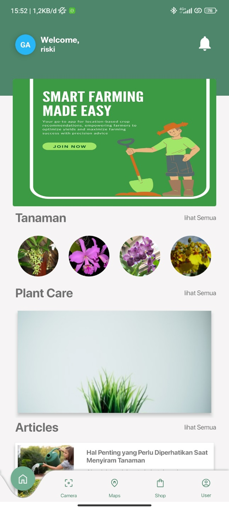
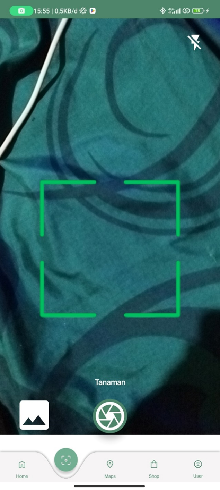
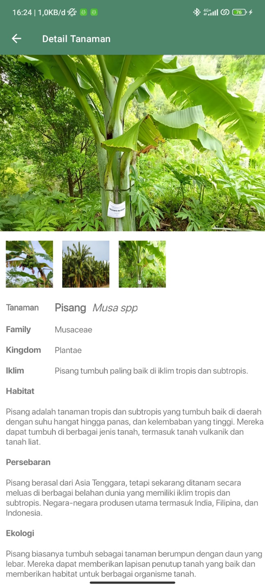
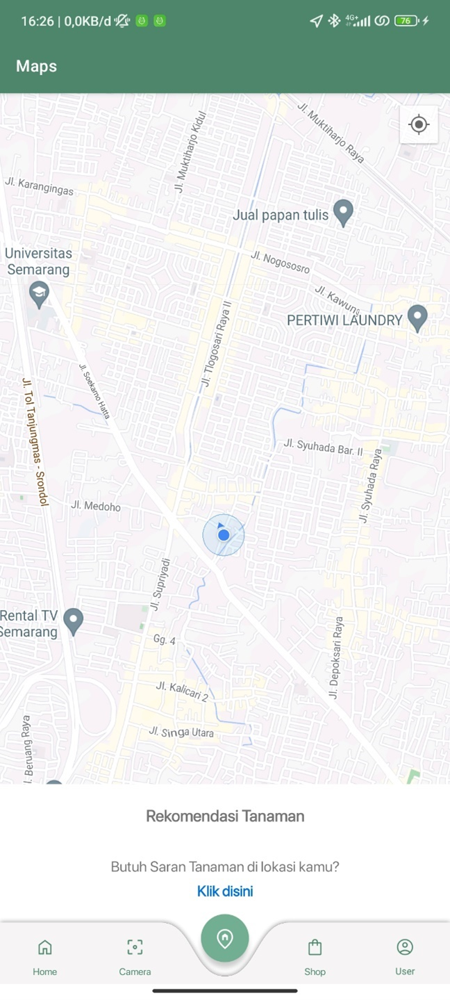
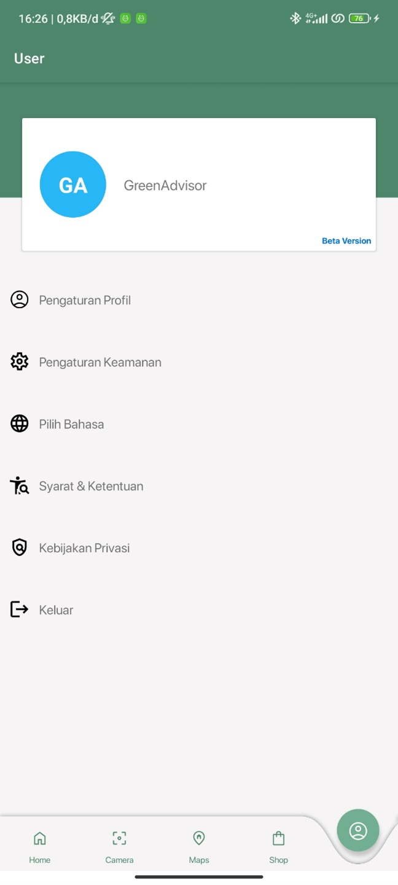

## Green Advisor
Green Advisor adalah sebuah aplikasi android yang membantu pengguna dalam melihat jenis tanaman, membantu dalam merekomendasi tanaman dilokasi pengguna, dan menyedian berbagai macam produk seputar dengan perawatan tanaman.

## Demo
Untuk Melihat demo aplikasi GreenAdvisor, anda bisa Clone Repo ini.
atau anda juga bisa mengunduh aplikasi [Klik Disini](https://bit.ly/GreenAdvisorTA)

## Teknologi
**Klien** Kotlin, Android Studio, android SDK, Retrofit, Lottie, Glide, XML, CursedBottomNavigation, CameraX, Google Maps.
**Server** Python, TensorFlow, Docker, Compute Engine, MySql, Laravel dll.

## Fitur
- **Klasifikasi Tanaman** : Anda dapat mengklasifikasi tanaman berdasarkan image yang anda kirim, dan mendapatkan informasi seputar tanaman tersebut.
- **Rekomendasi tanaman** : Anda dapat menemukan tanaman yang cocok ditanam dilokasi anda berdasarkan dengan ketinggian tanah di lokasi anda.
- **Artikel** : Anda dapat membaca artikel terkait dengan tanaman, seperti menanam tanaman, merawat tanaman, dll.
- **Shop** : Anda juga dapat menemukan berbagai produk untuk perawatan tanaman.

## ScreenShot

